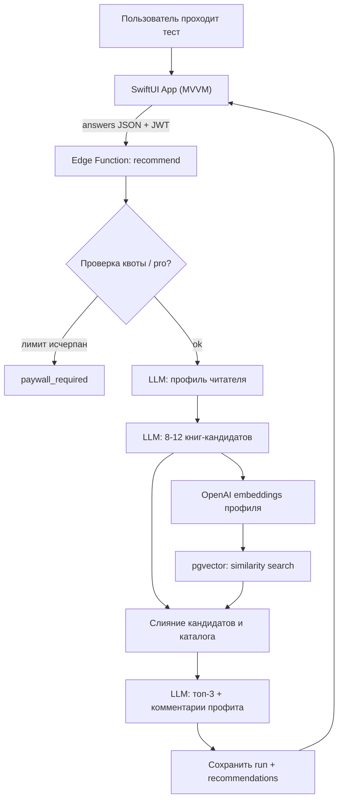

# krafIso

krafIso подбирает книги под личные качества и предпочтения пользователя. После короткого
психологического теста приложение выдаёт **топ-3 книги** (философия, психология,
саморазвитие, бизнес, художественная литература и т.д.) и для каждой книги — короткий
комментарий «что именно ты из неё извлечёшь».

- Интерфейс: русский. Каталог книг: преимущественно англоязычный.
- Бесплатный тариф: **2 прохождения теста**.
- Подписка: **$9.99 / месяц** — безлимитные прохождения (через RevenueCat).

## Технологический стек

| Слой | Технология |
| --- | --- |
| iOS-клиент | SwiftUI, MVVM, Swift Concurrency (`async/await`, `actor`, `@Observable`) |
| Авторизация | Supabase Auth — Sign in with Apple + Email/пароль |
| Бэкенд | Supabase Edge Functions (Deno / TypeScript) |
| База данных | PostgreSQL + `pgvector` (`halfvec`, HNSW) |
| LLM | OpenAI — `gpt-4o-mini` (генерация/реранк), `text-embedding-3-small` (эмбеддинги) |
| Подписка | RevenueCat (entitlement `pro`, Paywalls v2) |
| Логи и ошибки | Sentry (iOS SDK + Edge Functions) |

## Структура репозитория

```
.
├── krafIso/                 # iOS-приложение (SwiftUI, MVVM)
│   ├── App/                 # точка входа, инициализация сервисов
│   ├── Core/                # Supabase-клиент, конфиг, DI
│   ├── Models/              # доменные модели
│   ├── Services/            # сетевые сервисы и интеграции
│   ├── Features/            # экраны (Auth, Test, Recommendations, Paywall, Profile)
│   └── Resources/           # ассеты, локализация
├── supabase/
│   ├── migrations/          # SQL-миграции (схема, RLS, pgvector, RPC)
│   ├── functions/           
│   └── seed/                
├── .env.example             
└── README.md
```

## Архитектура рекомендаций (гибрид)


## Ограничение окружения

Сборка и запуск iOS-приложения возможны только на macOS с Xcode.
