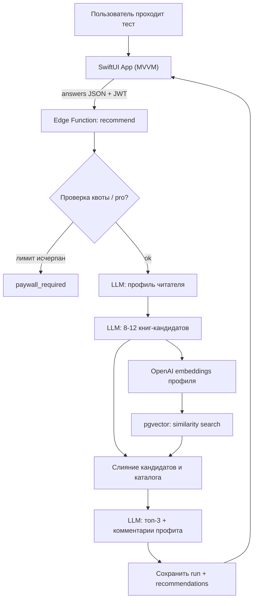

# krafIso

krafIso подбирает книги под личные качества и предпочтения пользователя. После короткого
психологического теста приложение выдаёт **топ-3 книги** (философия, психология,
саморазвитие, бизнес, художественная литература и т.д.) и для каждой книги — короткий
комментарий «что именно ты из неё извлечёшь».

- Интерфейс: русский. Каталог книг: преимущественно англоязычный.
- Бесплатный тариф: **2 прохождения теста**.
- Подписка: **$9.99 / месяц** — безлимитные прохождения (через RevenueCat).

## Технологический стек

| Слой | Технология |
| --- | --- |
| iOS-клиент | SwiftUI, MVVM, Swift Concurrency (`async/await`, `actor`, `@Observable`) |
| Авторизация | Supabase Auth — Sign in with Apple + Email/пароль |
| Бэкенд | Supabase Edge Functions (Deno / TypeScript) |
| База данных | PostgreSQL + `pgvector` (`halfvec`, HNSW) |
| LLM | OpenAI — `gpt-4o-mini` (генерация/реранк), `text-embedding-3-small` (эмбеддинги) |
| Подписка | RevenueCat (entitlement `pro`, Paywalls v2) |
| Логи и ошибки | Sentry (iOS SDK + Edge Functions) |

## Структура репозитория

```
.
├── krafIso/                 # iOS-приложение (SwiftUI, MVVM)
│   ├── App/                 # точка входа, инициализация сервисов
│   ├── Core/                # Supabase-клиент, конфиг, DI
│   ├── Models/              # доменные модели
│   ├── Services/            # сетевые сервисы и интеграции
│   ├── Features/            # экраны (Auth, Test, Recommendations, Paywall, Profile)
│   └── Resources/           # ассеты, локализация
├── supabase/
│   ├── migrations/          # SQL-миграции (схема, RLS, pgvector, RPC)
│   ├── functions/           # Edge Functions (recommend, revenuecat-webhook, _shared)
│   └── seed/                # сид каталога книг с эмбеддингами
├── .env.example             # пример переменных окружения
└── README.md
```

## Архитектура рекомендаций (гибрид)



## Переменные окружения

Скопируйте `.env.example` в `.env` (для локальной разработки Edge Functions) и заполните:

| Переменная | Где используется | Описание |
| --- | --- | --- |
| `SUPABASE_URL` | Edge Functions, iOS | URL проекта Supabase |
| `SUPABASE_ANON_KEY` | iOS | Публичный anon-ключ |
| `SUPABASE_SERVICE_ROLE_KEY` | Edge Functions | Сервисный ключ (только сервер!) |
| `OPENAI_API_KEY` | Edge Functions, seed | Ключ OpenAI |
| `OPENAI_CHAT_MODEL` | Edge Functions | По умолчанию `gpt-4o-mini` |
| `OPENAI_EMBEDDING_MODEL` | Edge Functions, seed | По умолчанию `text-embedding-3-small` |
| `SENTRY_DSN_EDGE` | Edge Functions | DSN Sentry для функций |
| `REVENUECAT_WEBHOOK_AUTH` | Edge Functions | Bearer-токен для проверки вебхука RevenueCat |
| `FREE_QUIZ_LIMIT` | Edge Functions | Лимит прохождений на free (по умолчанию `2`) |

iOS-секреты (несекретные публичные ключи) задаются в `krafIso/Core/AppConfig.swift`:
`SUPABASE_URL`, `SUPABASE_ANON_KEY`, RevenueCat public key (`appl_...`), Sentry DSN.

## Запуск бэкенда локально (Windows / macOS / Linux)

Требуется [Supabase CLI](https://supabase.com/docs/guides/cli) и Docker.

```bash
# 1. Старт локального стека Supabase (Postgres + Auth + Edge runtime)
supabase start

# 2. Применить миграции
supabase db reset            # применяет supabase/migrations/*

# 3. Залить каталог книг с эмбеддингами (нужен OPENAI_API_KEY)
deno run --allow-net --allow-env supabase/seed/seed.ts

# 4. Поднять Edge Functions локально
supabase functions serve --no-verify-jwt
```

## Деплой Edge Functions

```bash
supabase link --project-ref <your-project-ref>

# Секреты функций
supabase secrets set OPENAI_API_KEY=sk-...
supabase secrets set OPENAI_CHAT_MODEL=gpt-4o-mini
supabase secrets set OPENAI_EMBEDDING_MODEL=text-embedding-3-small
supabase secrets set SENTRY_DSN_EDGE=https://...
supabase secrets set REVENUECAT_WEBHOOK_AUTH=<random-strong-token>
supabase secrets set FREE_QUIZ_LIMIT=2

# Деплой
supabase functions deploy recommend
supabase functions deploy revenuecat-webhook
```

## Настройка dashboard (чек-лист)

- **Supabase → Auth → Providers → Apple**: добавить Bundle ID в `Client IDs`.
- **Apple Developer**: включить capability *Sign in with Apple*.
- **RevenueCat**: создать entitlement `pro`, offering с пакетом `$rc_monthly` ($9.99/мес).
  В *Integrations → Webhooks* указать URL
  `https://<project-ref>.functions.supabase.co/revenuecat-webhook` и Authorization header
  `Bearer <REVENUECAT_WEBHOOK_AUTH>`.
- **Sentry**: создать 2 проекта (iOS и `edge`), DSN положить в конфиги.

## Контракт Edge Function `recommend`

Запрос (`POST`, требует JWT пользователя в `Authorization: Bearer <token>`):

```json
{ "answers": { "openness": { "section": "Личность", "prompt": "...", "value": 4 } } }
```

Ответы:

- `200` — `{ run_id, is_pro, remaining_free, reader_profile, recommendations[] }`,
  где каждый элемент `recommendations` = `{ rank, profit_comment, book }`.
- `402` — `{ "error": "paywall_required", "used", "limit" }` (лимит бесплатных прохождений
  исчерпан). Клиент показывает `PaywallView`.
- `401` — нет/невалидный JWT.

## iOS

Сборка iOS-приложения требует macOS + Xcode. Разовая настройка проекта, зависимостей (SPM:
supabase-swift, purchases-ios, sentry-cocoa) и capabilities описана в
[`krafIso/PROJECT_SETUP.md`](krafIso/PROJECT_SETUP.md). Публичные ключи заполняются в
[`krafIso/Core/AppConfig.swift`](krafIso/Core/AppConfig.swift). Логи и ошибки на клиенте
идут через обёртку `Telemetry` (Sentry) с хлебными крошками на экранах входа и теста.

## Ограничение окружения

Сборка и запуск iOS-приложения возможны только на macOS с Xcode. Код SwiftUI в репозитории
полный, но `.xcodeproj`/`.xcworkspace` нужно создать в Xcode (см.
`krafIso/PROJECT_SETUP.md`). Бэкенд (миграции, Edge Functions, сид) поднимается на любой ОС.
